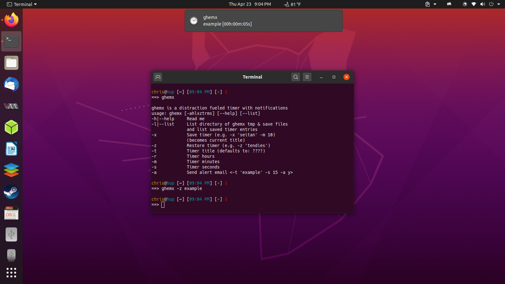
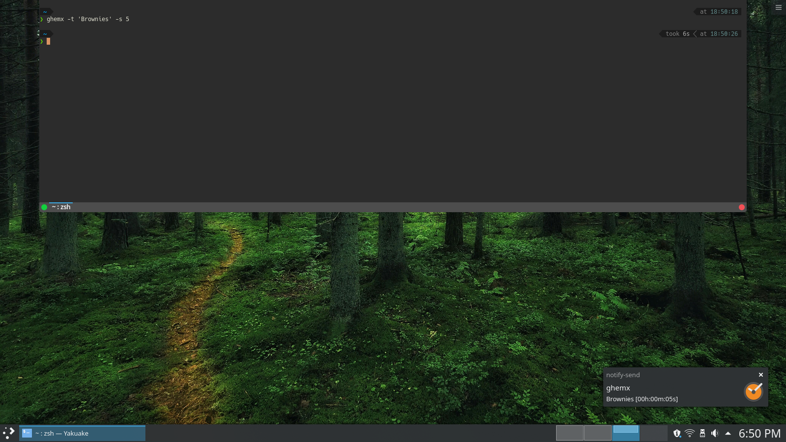

# ghemx

Bash based alarm/timer built for tiling window managers.


## Dependencies

- Bash

- libnotify (Required)

  > Ubuntu: libnotify-bin

- kdialog (Required)

  > KDE Desktop

- mplayer (Optional)

  > Notification sounds

- dunst (Optional)

  > Tiling WMs

- Bash shell friendly bar (Optional)

  > Tiling WMs

- mutt (Optional)
  
  > Send alarm/timer notifications through email

  - gpg key to [encrypt](https://pthree.org/2012/01/07/encrypted-mutt-imap-smtp-passwords/) .muttrc (if [mutt](https://wiki.archlinux.org/index.php/Mutt))

## Installation

```
cp ~/Downloads/ghemx ~/.local/bin/ghemx
```

```
echo "alias ghemx='/home/$USER/.local/bin/ghemx'" >> ~/.bashrc
```

Add timer_monitor (i3blocks folder) to bar configuration for realtime alarm/timer monitoring

## Sync with KDE Connect

> This synces all KDE Plasma Desktop notifications to paired device

- Android

  - KDE Connect > Three Dots (Top Right) > Plugin Settings > Toggle On: Receive Notifications

- KDE Plasma Desktop
  
  - KDE Connect Settings > Paired Device > Toggle On: Send Notifications > Gear Icon (First Icon to the right) > Check: Include Body + Icons
  
    > Uncheck: Persistent notifications only

- iOS?
  
  - [github/kdeconnect-ios](https://github.com/KDE/kdeconnect-ios#known-behavior-and-problems)
: "Notification syncing doesn't work because iOS applications can't access notifications of other apps"
## Usage

- Run with your favorite launcher (Gnome 3: ALT+F2, dmenu, rofi, etc.)

- Tested with Gnome 3, KDE Desktop, i3wm, & bspwm, etc.

- First saved timer creates dir ~/.config/ghemx & ghemx_timers.conf if not found

<pre>
ghemx is a distraction fueled timer with notifications
usage: ghemx [-ahlxztrms] [--help] [--list]
-h|--help     Read me
-l|--list     List directory of ghemx tmp & save files
              and list saved timer entries
-x            Save timer (e.g. -x 'seitan' -m 10)
              (becomes current title)
-z            Restore timer (e.g. -z 'tendies')
-t            Timer title (defaults to: ????)
-r            Timer hours
-m            Timer minutes
-s            Timer seconds
-a            Send alert email (e.g. -t 'example' -s 15 -a y)
</pre>

## Screenshots

> Gnome 3 (Ubuntu 20.04)



> KDE Plasma (Kubuntu 20.04)



> i3-gaps + Lemonbar (Orange text) (Arch Linux 2018)


